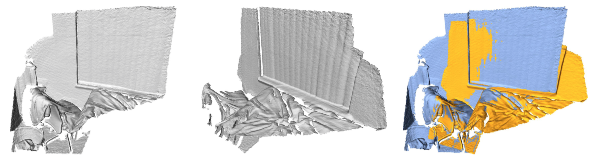

## Learning Compact Geometric Features

This page describes the dataset used in [Learning Compact Geometric Features](https://arxiv.org/abs/1709.05056) (ICCV 2017). The dataset is a set of point clouds reconstructed from raw RGB-D images provided by the [SceneNN dataset](http://people.sutd.edu.sg/~saikit/projects/sceneNN/). The point clouds were reconstructed using the pipeline detailed in [Robust Reconstruction of Indoor Scenes](http://redwood-data.org/indoor/). 



### Download

The dataset can be downloaded [here](https://drive.google.com/drive/folders/1YOYg5TAeC7Gtrmj488Q6baFKGw3xkwML) (54GB). 

### Dataset

The download contains a set of folders, one for each model in the SceneNN dataset, named by the number of the corresponding model. In each folder there is a single compressed numpy file (`.npz`) containing all the data corresponding to that model. A compressed numpy file can be opened in python as follows.

```python
import numpy as np
npzfile = np.load('xyz.npz')
```

The `npzfile` contains eight fields.
1. `npzfile['data']`: The raw spherical histograms representing the local geometry around each point.
2. `npzfile['triplets']`: A list of anchor-positive-negative triplets for the model.
3. `npzfile['offsets']`: Each model is comprised of several fragments. This field is an array where the `i`th element contains the offset to the beginning of the `i`th fragment in the `data` and `points` arrays.
4. `npzfile['pairs']`: A list of overlapping pairs of fragments, as defined in the paper.
5. `npzfile['points']`: The `(x,y,z)` coordinates of all the points for all fragments in the model. The `i`th element in this field is in one-to-one correspondence with the `i`th element in the `data` field.
6. `npzfile['threshold']`: Threshold value used to define positive pairs in the aligned point clouds.
7. `npzfile['diameter']`: The diameter of the model.
8. `npzfile['icp']`: ICP transforms to more tightly align pairs of models. The first dimension of this field is equal to the first dimension of the `pairs` field. 

The `offsets` field contains the offsets to the `i`th fragment in the `data` and `points` arrays. So the `i`th fragment can be retrived by the following code.

```python
data = npzfile['data']
points = npzfile['points']
offsets = npzfile['offsets']

points_i = points[offsets[i]:offsets[i+1]]
data_i = data[offsets[i]:offsets[i+1]]
```

The pairs field contains a list of pairs `(i,j)` such that the `i`th and `j`th fragments overlap, according to the definition in the paper. The fragments are already approximately aligned, but the alignment can be made tighter using the provided ICP transforms. Let `(i, j)` denote the `k`th pair in `pairs`. The `k`th ICP transform aligns the `i`th fragment to the `j`th fragment. This can be done by the following code.

```python
pairs = npzfile['pairs']
icp = npzfile['icp']

i, j = pairs[k]

aligned_points_i = (np.dot(icp[k], points_i.T).T)[:,:-1]
```

### Training, Validation, and Test Sets

Three additional files `train-subset.txt`, `val-subset.txt`, and `test-subset.txt` are includded in the top level directory of the dataset. These files specify the models that comprise our training, validation, and test sets respectively. 

In addition, there are three compressed numpy files in the top level directory: `data_train.npz`, `data_val.npz`, and `data_test.npz`. These files contain all of the combined data for the training, validation, and test sets respectively. They have exactly the same fields as detailed above, with the exception that `threshold` and `diameter` are arrays and thus are named `thresholds` and `diameters`.

### Acknowledgements

If you use this dataset in your own research, please cite the following papers.
 
Marc Khoury, Qian-Yi Zhou, and Vladlen Koltun. *Learning Compact Geometric Features*. ICCV 2017. [Bibtex](https://marckhoury.github.io/CGF/bibtex)

Binh-Son Hua, Quang-Hieu Pham, Duc Thanh Nguyen, Minh-Khoi Tran, Lap-Fai Yu, and Sai-Kit Yeung. *SceneNN: A Scene Meshes Dataset with aNNotations*. 3DV 2016. [Bibtex](https://marckhoury.github.io/CGF/bibtex)
